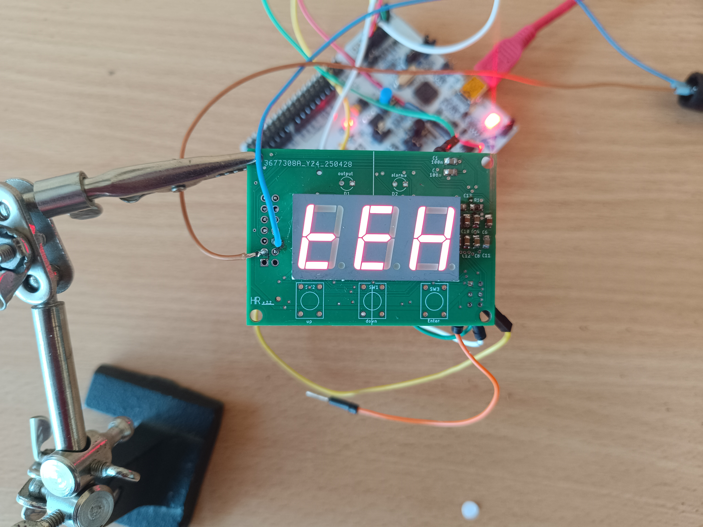
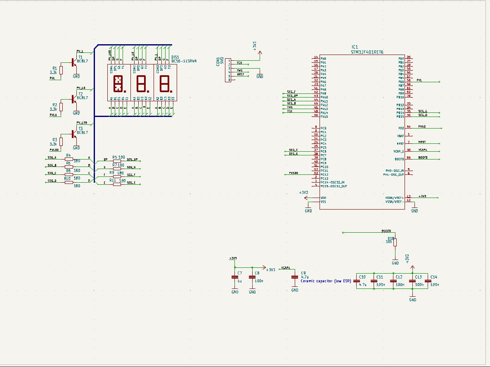

# 7-Segment Display Library for STM32

A library to dynamic control a 7-segment display on STM32 micricontroers.



## Basic Usage


Include heder file
```c
/* USER CODE BEGIN Includes */
#include "../myLibrary/Inc/SevenSegment.h"
/* USER CODE END Includes */
```

Declaration on global variable
```c
/* USER CODE BEGIN PV */
volatile bool displayRefresh = false;

/* USER CODE END PV */
```


Inicialization (in main)
```c
/* USER CODE BEGIN 2 */
//Seven segment initialize
SevenSegment display;

static segmentsPin segPin[8];
segPin[0].port = segmentA_GPIO_Port;
segPin[0].pin = segmentA_Pin;
segPin[1].port = segmentB_GPIO_Port;
segPin[1].pin = segmentB_Pin;
segPin[2].port = segmentC_GPIO_Port;
segPin[2].pin = segmentC_Pin;
segPin[3].port = segmentD_GPIO_Port;
segPin[3].pin = segmentD_Pin;
segPin[4].port = segmentE_GPIO_Port;
segPin[4].pin = segmentE_Pin;
segPin[5].port = segmentF_GPIO_Port;
segPin[5].pin = segmentF_Pin;
segPin[6].port = segmentG_GPIO_Port;
segPin[6].pin = segmentG_Pin;
segPin[7].port = segmentP_GPIO_Port;
segPin[7].pin = segmentP_Pin;


segmentDigit segDig[3];
segDig[0].port = digOnes_GPIO_Port;
segDig[0].pin = digOnes_Pin;
segDig[1].port = digTens_GPIO_Port;
segDig[1].pin = digTens_Pin;
segDig[2].port = digHundreds_GPIO_Port;
segDig[2].pin = digHundreds_Pin;

display.intilization(segPin, segDig, 3, true);  //3 - digits; true - common cathode

/* USER CODE END 2 */
```

Write on display
```c
//Integer number
display.setNumber(-3);

//floating point number
display.setNumberF(1.5);

//Use string
display.message("FFF");

//With operator <<
display << "tEh";
```

Reflesh segments (in while)
```c
if (displayRefresh)
{
    display.refreshDisplay();
    displayRefresh = false;
}
/* USER CODE END WHILE */
```

## Set frequency for refresh seven segments
Refresh frequency have to be around 100 Hz per digit. In this examples use timer 2.

In main.cpp
```c
/* USER CODE BEGIN 2 */
//Start the Timer TIM3 in Interrupt mode
if (HAL_TIM_Base_Start_IT(&htim2) != HAL_OK)
{
  /* Starting Error */
  Error_Handler();
}
```

In stm32f4xx_it.cpp 
Include heder file on the class
```c
/* Private includes ----------------------------------------------------------*/
/* USER CODE BEGIN Includes */
#include "../myLibrary/Inc/SevenSegment.h"
/* USER CODE END Includes */
```
In function void TIM2_IRQHandler(void) set variable for refresh segment
```c
void TIM2_IRQHandler(void)
{
  /* USER CODE BEGIN TIM2_IRQn 1 */
  displayRefresh = true;
  /* USER CODE END TIM2_IRQn 1 */
}
```

## Schematics


